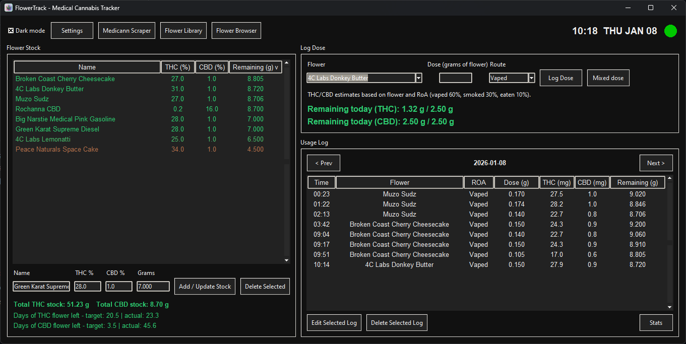
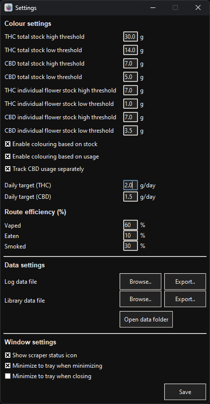
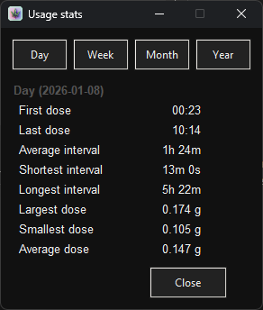
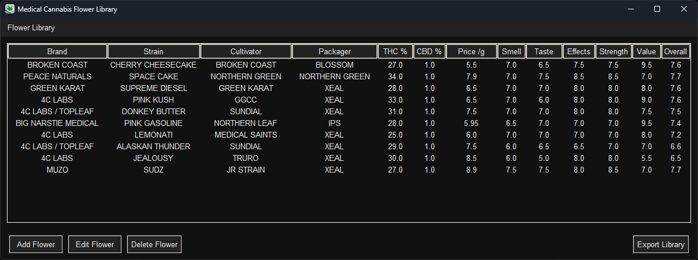
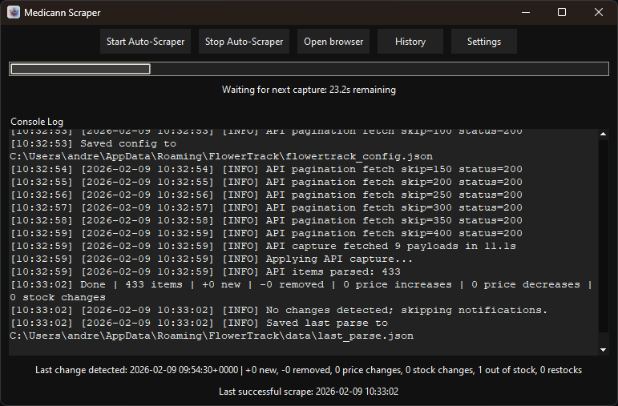
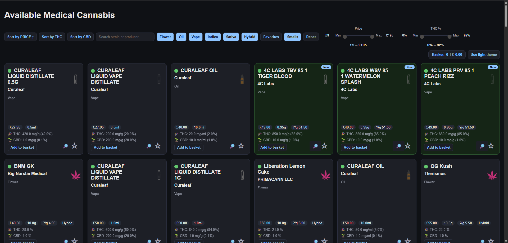
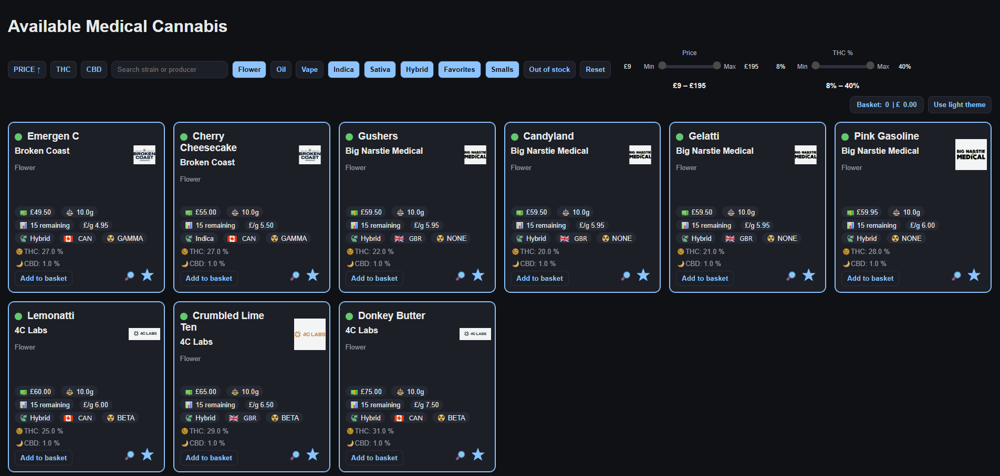
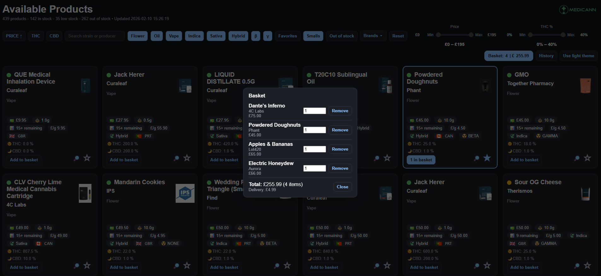

# FlowerTrack

FlowerTrack is a Windows desktop app for tracking medical cannabis usage and stock, with an integrated scraper that monitors a Medicann page for changes. It combines a dosage tracker, flower library, and automated price/stock change detection with optional Home Assistant notifications and local HTML snapshots.

## Features
- Track flower stock, THC/CBD potency, remaining grams, and daily targets.
- Log doses by route of administration with per-day totals.
- Flower Library and Mix Calculator tools.
- Scraper for Medicann page data with change detection (new/removed items, price/stock changes).
- Home Assistant webhook notifications and optional Windows desktop notifications.
- HTML snapshots served locally (favorites and filters preserved).

## The Flower Browser (local webpage)
The scraper generates a local HTML page that you can open from the app. It’s designed for fast scanning and filtering of the live product list.
- Search, filter, and sort by brand, strain, type, or stock.
- Visual badges for new/removed items and price movements.
- THC/CBD normalization and clear per-gram price display.
- Favorites are saved locally in your browser session.
- Basket mode lets you stage products for quick comparisons.

## Scraper behavior
- Logs in (if configured), waits after login, then revisits the target page.
- Waits after navigation, then collects page text.
- Retries on empty parses using the retry settings.
- Sends notifications only when there are real changes.

## Home Assistant notifications
- Set the webhook URL and (optional) token in the scraper settings.
- Payload includes new/removed items, price changes, and stock changes.
- Quiet hours and summary/full detail are configurable.

## Desktop notifications
- Enable "Send Windows desktop notifications" in scraper settings.
- Uses win10toast for toasts. (No click-through actions available.)

## Screenshots
### Tracker dashboard
Shows usage, stock, and daily targets in a single view.



### Tracker settings
Configure thresholds, routes, and display options.



### Usage stats
Shows usage history and trends over time.



### Flower library
Stores strains, notes, and metadata.



### Scraper window
Shows auto-scraper controls, progress, and log output.



### Flower Browser
Local webpage with filters, badges, and change highlights.



### Flower Browser favorites
Favorites list for quick access.



### Flower Browser basket
Basket view for comparing items.



### Mix calculator
Calculator for blend ratios.


## Requirements
- Windows 10/11
- Python 3.12 (dev only)
- Playwright browsers (auto-installed on first run or via `playwright install`)

## Quick start (development)
```powershell
py .\flowertracker.py
```

## Build (single exe)
Use the one-liner in `buildline.txt`, or:
```powershell
pyinstaller --noconfirm --clean --onefile --windowed --icon assets/icon.ico --add-data "assets;assets" --add-data "flowerlibrary.py;." --add-data "mixcalc.py;." --name FlowerTrack flowertracker.py
```
## Configuration and data
All user data and configs are stored under:
```
%APPDATA%\FlowerTrack
```
Key files:
- `flowertrack_config.json` (unified tracker + scraper settings)
- Tracker data and library JSON files
- `Exports\` (HTML snapshots)

Credentials and tokens are stored encrypted (DPAPI on Windows).

## Troubleshooting
- If Playwright browsers are missing, run:
  ```powershell
  playwright install
  ```
- If the scraper logs "No products parsed", increase wait time or retries.
- Use the console log in-app for detailed scrape output.

## Tests
```powershell
py -m unittest
```

## Repository layout
- `flowertracker.py` entry point
- `ui_*.py` UI modules
- `capture.py` scraper worker
- `parser.py` HTML parser
- `exports.py` HTML export generation
- `config.py` config persistence and migrations
- `tests/` unit tests
